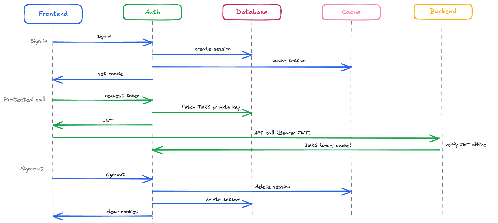

# oil-auth

A lightweight, self-hosted authentication microservice built with [Bun](https://bun.sh) and [Hono](https://hono.dev), using [better-auth](https://better-auth.com) for session management backed by [PostgreSQL](https://www.postgresql.org) and optional [Redis](https://redis.io) caching.

---

## Features

- Email & password authentication — sign-up, sign-in, sign-out, session retrieval
- Two-factor authentication (TOTP and/or email OTP), configurable via env
- Password reset email with configurable expiry
- File-based HTML email templates (customizable in `src/templates/email/`)
- SMTP email delivery via nodemailer
- Session cookie cache via Redis (falls back gracefully when Redis is absent)
- Custom snake_case database schema through better-auth's schema mapping
- Production-ready OpenTelemetry: named tracers, `X-Request-ID` propagation, child span linking
- Structured JSON logging with [pino](https://getpino.io) (pretty in development)
- CORS and identity middleware
- Multi-stage Docker build with non-root user
- Docker Compose for local development and testing

---

## Tech Stack

| Layer | Library / Tool |
|---|---|
| Runtime | [Bun](https://bun.sh) |
| HTTP framework | [Hono](https://hono.dev) |
| Auth | [better-auth](https://better-auth.com) |
| Database | PostgreSQL 16 · [`pg`](https://node-postgres.com) |
| Cache | Redis 7 · [ioredis](https://github.com/redis/ioredis) |
| Tracing | [OpenTelemetry Node SDK](https://opentelemetry.io) |
| Email | [nodemailer](https://nodemailer.com) |
| Logging | [pino](https://getpino.io) |
| Config validation | [zod](https://zod.dev) |
| Linting / formatting | [Biome](https://biomejs.dev) |

---

## Project Structure

```
src/
├── cmd/server/           # Entrypoint — wires all dependencies and starts Bun server
├── config/               # Config schema (zod), env helpers, typed Config export
├── domains/
│   ├── identity/         # IdentityService, identity port interface, domain types
│   └── token/            # errors, Repository interface + PostgreSQL impl, TokenService
├── infras/
│   ├── logger/           # Pino logger factory
│   ├── otel/             # OpenTelemetry SDK setup
│   ├── postgres/         # PostgresClient — pool wrapper with connection logging
│   ├── redis/            # RedisClient — ioredis wrapper with connection logging
│   └── smtp/             # SmtpClient — nodemailer wrapper, template loader
├── middleware/
│   ├── identity.ts       # Attaches identity context to request
│   └── tracing.ts        # OpenTelemetry span per request, X-Request-ID
├── providers/
│   └── betterauth/
│       ├── hooks.ts      # Auth handler utility
│       ├── provider.ts   # BetterAuthProviderAdapter (identity port impl)
│       ├── schema/       # DB table/column mapping + createSchema() override system
│       └── service.ts    # BetterAuthService — better-auth config, 2FA, reset password
├── templates/
│   └── email/            # HTML email templates (two-factor-otp, email-verification, reset-password)
└── transport/
    └── http/
        ├── server.ts     # HttpServer — middleware stack, health check, route mounting
        ├── openapi.ts    # /openapi.json + /docs (Scalar UI, dev only)
        └── handler/      # HTTP handlers
```

---

## Getting Started

### Prerequisites

- [Bun](https://bun.sh) ≥ 1.0
- PostgreSQL 16+
- Redis 7+ *(optional — cookie cache is disabled when Redis is unavailable)*

### 1. Install dependencies

```bash
bun install
```

### 2. Configure environment

```bash
cp .env.example .env
```

Minimum required variables:

```dotenv
DB_POSTGRES_HOST=localhost
DB_POSTGRES_PORT=5432
DB_POSTGRES_NAME=oil_auth
DB_POSTGRES_USER=postgres
DB_POSTGRES_PASSWORD=yourpassword
```

See [.env.example](.env.example) for the full reference.

### 3. Apply database migrations

Generate the SQL schema file:

```bash
bun run migrate:generate
```

Apply to the database:

```bash
bun run migrate:up
```

### 4. Start the development server

```bash
bun run dev
```

Server is available at `http://localhost:3000`.

---

## Environment Variables

See [.env.example](.env.example) for the full reference. Key variables by feature:

### Two-Factor Authentication (2FA)

| Variable | Default | Description |
|---|---|---|
| `AUTH_2FA_ENABLED` | `false` | Enable 2FA for sign-in |
| `AUTH_2FA_METHOD` | `totp` | Method: `totp`, `otp`, or `totp,otp` |
| `AUTH_2FA_OTP_EXPIRES_IN` | `300` | OTP expiry in seconds |
| `AUTH_EMAIL_VERIFICATION_OTP_ENABLED` | `false` | Send OTP on signup |

### SMTP (required for OTP and password reset)

| Variable | Default | Description |
|---|---|---|
| `SMTP_HOST` | — | SMTP server host |
| `SMTP_PORT` | `587` | SMTP server port |
| `SMTP_SECURE` | `false` | Use TLS |
| `SMTP_USER` | — | SMTP username |
| `SMTP_PASSWORD` | — | SMTP password |
| `SMTP_FROM` | `noreply@example.com` | Sender address |

### Password Reset

| Variable | Default | Description |
|---|---|---|
| `AUTH_RESET_PASSWORD_EXPIRES_IN` | `3600` | Reset token expiry in seconds |

---

## Docker

### Local development (app + postgres + redis)

```bash
bun run docker:up
bun run docker:down
```

### App-only (external infrastructure)

```bash
docker compose -f deployments/app.yml up
```

---

## API Reference

Interactive API documentation is available at [`/docs`](http://localhost:3000/docs) when running the development server.

---

## Sequence Diagram



---

## Scripts

| Script | Description |
|--------|-------------|
| `bun run dev` | Start in development mode |
| `bun run start` | Start in production mode |
| `bun run migrate:generate` | Generate SQL schema from auth config |
| `bun run migrate:up` | Apply migrations to the database |
| `bun run typecheck` | TypeScript type checking |
| `bun run lint` | Lint with Biome |
| `bun run lint:fix` | Lint and auto-fix |
| `bun run test` | Unit tests |
| `bun run test:integration` | Integration tests |
| `bun run test:e2e` | End-to-end tests |
| `bun run test:all` | All tests |
| `bun run docker:up` | Start full Docker Compose stack |
| `bun run docker:down` | Stop Docker Compose stack |

---

## Contributing

Please read [CODE_OF_CONDUCT.md](CODE_OF_CONDUCT.md) before contributing.

1. Fork this repository
2. Create a feature branch: `git checkout -b feat/your-feature`
3. Commit your changes
4. Open a pull request

---

## License

[MIT](LICENSE)
